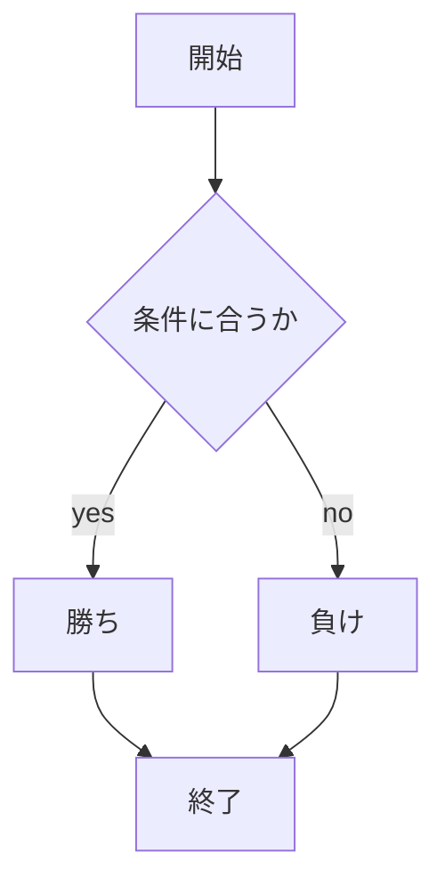

# webpro_06
## このプログラムについて
## ファイル一覧
ファイル名 | 説明
-|-
app5.js | プログラム本体
public/janken.html | ジャンケンの開始画面
public/janken.ejs | ejsファイル

2024/10/29
2024/11/5
```javascript
console.log("Hello");
```
 1. ```app5.jsをnodejsで立ち上げる```
 1. 　あいこは試合数に入らない
 ```mermaid
flowchart TD;
開始 --> 終了;
```
