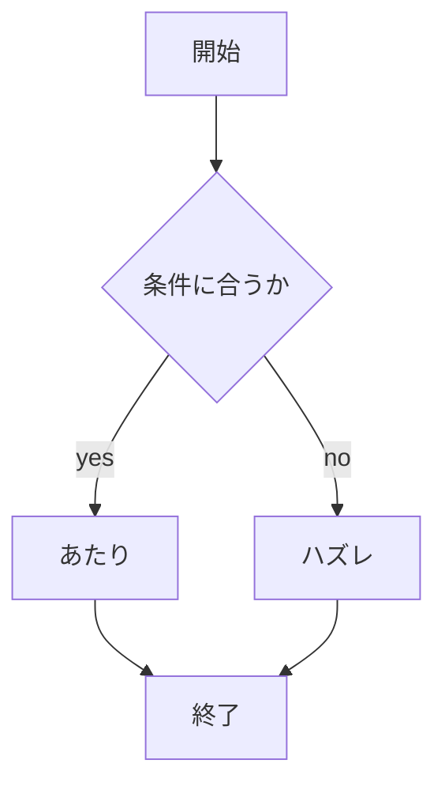

# webpro_06 report
## 今回更新したプログラムについて
今回は宝あてゲームとクトゥルフ神話TRPGのキャラ作成で使うことができるプログラムを作成した
ファイル名 | 説明
-|-
app5.js | プログラム本体
public/takara |  宝あてゲームのejsファイル
public/6charactorseet.ejs | キャラクターシート作成用ejsファイル

##　app5.jsについて
#### 起動方法
pcにnode.jsが入っていない場合はnode.jsをインストールし，使用するファイルにnpnが入っていない場合インストールする
1.  node.jsのインストール</br>
2.  npn install
入っているときはここから

1. ```node app5.js```をターミナルに書き起動する
このときディレクトリは動かしたいファイルが入っている適当なものでやる必要がある
```yoppy@YoppysMacBook webpro_06 % node app5.js```のように起動したいファイルが収まっている場所で起動する
(サーバーを終わらせたい場合はターミナル場で```control+c``` + cを押す)
1. webブラウザのURLURL欄に使いたいアクションのものを下記の様にいれる
    ```http://localhost:8080/6charactorseet```
    これを入力するとクトゥルフ神話TRPGのキャラクターシートを作成するときに使うプログラムを開くことができる．
    ```http://localhost:8080/takara```
    これを入力すると宝あてゲームで遊ぶことができる．
    この他にもapp5.jsには様々なプログラムが入っていて使用可能なものは以下のとおりである
    ```
    http://localhost:8080/icon アイコン
    http://localhost:8080/luck おみくじ
    http://localhost:8080/show 挨拶
    http://localhost:8080/janken ジャンケン
    ```
    などを行うことができる．

### 編集したファイルのGitでの管理方法
まずはGithubのアカウントをなければ作る 
つぎにGithubの各自ホームにあるアカウントアイコンをクリックし，Settingをクリックする
設定画面を下までスクロールし，Developer settingsをクリックする
画面が変わったらPersonal access tokensをクリックし，Tokens (classic) をクリックする．
その後Generate new token(classic) をクリックして，ここで，パスワード入力やパスキーによる認証が必要になるので指示の通り実行していく．
画面が変わったらトークン名を決め，pepoにチェックをしてGenerate tokenをクリックする
発行されたトークン名を忘れてしまうと再度トークンを作らなくてはならないので忘れないようにする．
Gitで管理する際，誰が変更したか明らかにするため，編集したファイルのある適切なディレクトリで以下のようにユーザ名とメールアドレスを登録する．
```
% git config --global user.name "Yuu Yoshioka"
% git config --global user.email "m24G1140@s.chibakoudai.jp"
```
この作業は1回だけ実行しておけば良い．

編集した内容をGitに加えるときは以下を適切なディレクトリ実行する
```% git add .```
編集した際にコメントを残す際は以下の'コメント'のようにコメントする
```% git commit -am 'コメント'```
編集したコードなどをgithubにのせたいときは以下のようにプッシュする
```% git push```
このあとここでアクセストークンが必要になるのでアクセストークンは忘れないようにする

### app5.js 今回追加した部分の機能説明
####　宝あてゲーム
このゲームは10個のドアに1つ宝が隠されているのでそれを当てるというゲームです
##### 使い方
まず適当なディレクトリで```node app5.js```をターミナルに書き起動し，webサイトのURLに```http://localhost:8080/takara```と入力すると
ゲーム画面になるので遊ぶことができる
このゲームは
選んだドアがコンピューターがおいた宝にあっているかどうかと合っていた確率を表示します．
また簡略化して考えると以下のフローチャートのようになります
実行例
```
ドア１を選んだ場合
このゲームでは、10個のドアの中に，宝が隠されています．この中から宝を探し出してください!
あなた選択は1です．
判定：はずれ
あたりは7でした．
現在1回チャレンジしてあたりを0回取り，1回はずれています．
成功確率は0です．
```


####　クトゥルフ神話TRPGのキャラクターシート作成用
このプログラムはクトゥルフ神話TRPGをプレイするにあたってキャラクターの能力値をダイスを使って決めるだが大変なので自動化した．またキャラに難易度を設定し能力値がわざと低くなる設定も作成した
実行例(難易度hardの場合)
まずラジオボタンで難易度を選び送信すると以下のようになる
```
作成結果

STR=7
CON=4
SIZ=8
DEX=4
APP=5
INT=10
POW=8
EDU=12
幸運=40
ダメージボーナス=0
san=40
HP=6
MP=8
アイディア=50
知識=60
職業ポイント=240
趣味ポイント=100
```
